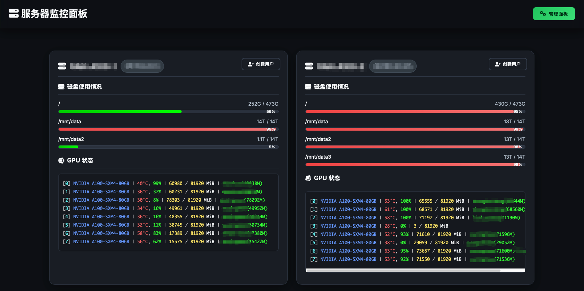
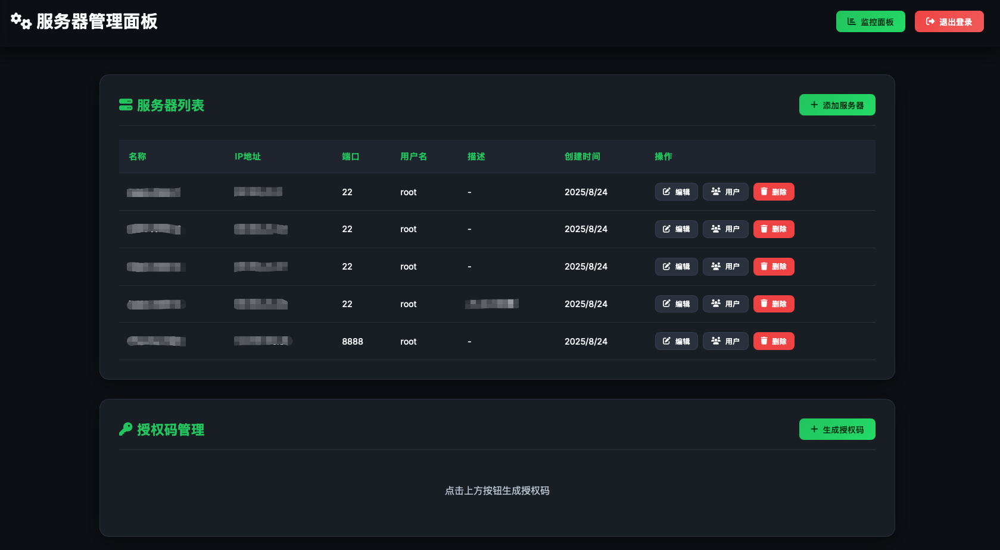

# 🖥️ Server Management Panel

[](https://www.python.org/downloads/)
[](https://flask.palletsprojects.com/)
[](LICENSE)

一个基于Flask的现代化服务器监控和管理面板，提供实时服务器状态监控、用户管理和SSH密钥分发功能。

## ✨ 特性

### 🔍 实时监控
- **服务器状态**: CPU、内存、磁盘使用情况
- **GPU监控**: 支持NVIDIA GPU状态和使用率（基于gpustat）
- **响应式界面**: 适配桌面和移动设备
- **实时更新**: 自动刷新服务器状态

### 👥 用户管理
- **SSH用户创建**: 自动生成SSH密钥对
- **授权码系统**: 安全的用户创建流程
- **权限管理**: 支持sudo权限分配
- **批量管理**: 查看、删除用户账户

### 🛡️ 安全特性
- **数据加密**: 敏感信息加密存储
- **会话管理**: 安全的管理员认证
- **权限隔离**: 普通用户与管理员功能分离
- **授权码验证**: 临时、一次性授权机制

### 🎨 现代化界面
- **暗色主题**: 优雅的深色配色方案
- **卡片式布局**: 清晰的信息展示
- **进度条显示**: 直观的资源使用情况
- **响应式设计**: 自适应不同屏幕尺寸

## 🚀 快速开始

### 📋 前置要求

- Python 3.7+
- pip包管理器
- SSH访问目标服务器的权限

### 🔧 安装

1. **克隆项目**
```bash
git clone https://github.com/Zheng-Chong/server-management-panel.git
cd server-management-panel
```

2. **安装依赖**
```bash
pip install -r requirements.txt
```

3. **初始化数据库**
```bash
python init_database.py
```

4. **启动应用**
```bash
python app.py
```

5. **访问界面**
- 主监控面板: http://localhost:5000/
- 管理员登录: http://localhost:5000/admin/login

### 🔑 默认账户

管理员账户信息：
- **用户名**: `admin`
- **密码**: `123456`

> ⚠️ **安全提醒**: 首次登录后请立即修改默认密码！

## 📁 项目结构

```
ServerManage/
├── 📄 app.py                    # 主应用程序
├── 🗄️ database.py               # 数据库管理模块
├── 🔄 migrate_data.py           # 数据迁移脚本
├── 🔒 reset_admin_password.py   # 密码重置工具
├── 📋 requirements.txt          # Python依赖
├── 🚀 start.sh                  # 启动脚本
├── 📁 templates/                # HTML模板
│   ├── 🏠 index.html           # 主监控界面
│   ├── ⚙️ admin.html            # 管理员界面
│   └── 🔐 admin_login.html      # 管理员登录界面
└── 📖 DEPLOYMENT.md            # 详细部署文档
```

## 💻 使用说明

### 👀 用户端功能

1. **查看服务器状态**
   - 实时CPU、内存、磁盘使用情况
   - GPU状态和进程信息
   - 网络和系统信息

2. **创建用户账户**
   - 输入用户名和授权码
   - 自动生成SSH密钥对
   - 下载私钥文件

### 🔧 管理员功能

1. **服务器管理**
   - 添加/删除/编辑服务器信息
   - 批量服务器操作
   - 连接状态监控

2. **用户管理**
   - 查看服务器用户列表
   - 删除用户账户
   - 分配/撤销sudo权限

3. **授权码管理**
   - 生成临时授权码（30分钟有效）
   - 一次性使用限制
   - 使用说明生成

4. **系统设置**
   - 修改管理员密码
   - 安全配置管理

## 🔒 安全说明

### 数据保护
- 服务器密码使用Fernet加密算法加密存储
- 加密密钥独立存储，自动生成
- SQLite数据库本地存储

### 访问控制
- 管理员功能需要登录验证
- 用户创建需要有效授权码
- 会话超时自动登出

### 生产环境建议
- 使用HTTPS协议
- 设置环境变量`SECRET_KEY`
- 配置防火墙限制访问
- 定期备份数据库和加密密钥

## 🛠️ API 参考

### 用户API
- `GET /api/status` - 获取服务器状态
- `POST /api/create-user` - 创建用户账户
- `GET /api/download-key/<server>/<user>` - 下载SSH私钥

### 管理员API
- `POST /api/admin/login` - 管理员登录
- `GET /api/admin/servers` - 获取服务器列表
- `POST /api/admin/generate-auth-code` - 生成授权码
- `POST /api/admin/change-password` - 修改密码

更多API详情请参见 [DEPLOYMENT.md](DEPLOYMENT.md)

## 🔧 配置

### 环境变量
```bash
export SECRET_KEY="your-secret-key-here"  # 生产环境必须设置
```

### 数据库配置
系统自动创建SQLite数据库，无需手动配置。

## 🆘 故障排除

**Q: 忘记管理员密码怎么办？**
```bash
python reset_password.py
```

**Q: 数据库损坏如何恢复？**
```bash
python init_database.py
```

**Q: 无法连接服务器**
- 检查SSH连接配置
- 验证服务器IP和端口
- 确认SSH密钥权限

更多问题解决方案请查看 [DEPLOYMENT.md](DEPLOYMENT.md)

## 🤝 贡献

欢迎提交Issue和Pull Request！

1. Fork 项目
2. 创建特性分支 (`git checkout -b feature/AmazingFeature`)
3. 提交更改 (`git commit -m 'Add some AmazingFeature'`)
4. 推送到分支 (`git push origin feature/AmazingFeature`)
5. 开启 Pull Request

## 📜 许可证

本项目采用 MIT 许可证 - 查看 [LICENSE](LICENSE) 文件了解详情

## 🙏 致谢

- [Flask](https://flask.palletsprojects.com/) - Web框架
- [Paramiko](https://www.paramiko.org/) - SSH客户端
- [Font Awesome](https://fontawesome.com/) - 图标库
- [Google Fonts](https://fonts.google.com/) - 字体服务

## 📸 预览

### 主监控面板


### 管理员界面


---

<div align="center">

**[⭐ 如果这个项目对你有帮助，请给一个Star！](https://github.com/Zheng-Chong/server-management-panel)**

Made with ❤️ by [Zheng-Chong](https://github.com/Zheng-Chong)

</div>